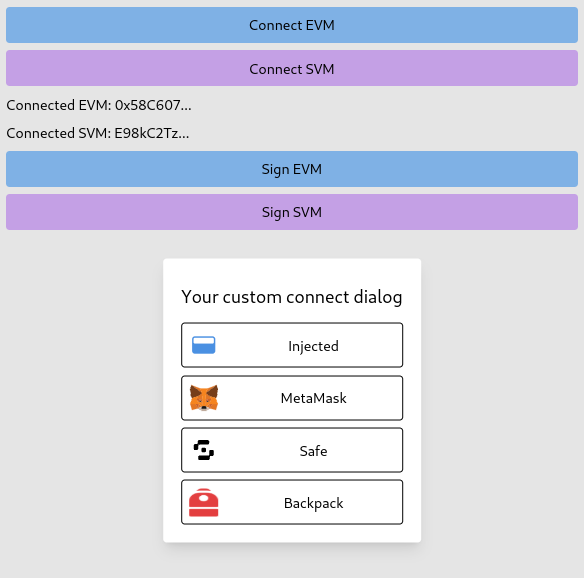

# svallet: headless svelte wallet logic for EVM & SVM

> Proof of Concept - expect bugs and breaking changes!

Svallet is a headless wallet library for easily integrating wallet connection logic into your Svelte 5 dapps leveraging Svelte runes, it is a headless library which means you are supposed to build your own UI for connecting/disconnecting and managing the wallet.

## Usage

Install peer dependencies `svelte`, `viem`, `@wagmi/core` then you can use`svallet`.

```bash
bun add viem
bun add @wagmi/core

bun add svallet
```

This is an example of how you can use Svallet in your SvelteKit project but it can be used without it as long as you use Svelte 5!

```svelte
<script>
  // +layout.svelte

  /** @import { EvmContext } from 'svallet/evm' */
  /** @import { SvmContext } from 'svallet/evm' */

  import { setContext } from 'svelte';

  import create_evm from 'svallet/evm';
  import create_svm from 'svallet/svm';

  import { mainnet } from 'viem/chains';

  /** @type {EvmContext} */
  const evm = create_evm({ chains: [mainnet] });

  /** @type {SvmContext} */
  const svm = create_svm();

  setContext("evm", evm);
  setContext("svm", svm);

  // Now you can use evm and svm contexts to connect/disconnect/manage wallet in your pages/components!
  // Check out demo page in src/routes/+page.svelte and example connect component in src/routes/EvmConnect.svelte
  // evm.connect(1, { Component: EvmComponent });
</script>
```

## Demo

Demo is available in `src/routes`, it includes a simple example of connecting and signing a message with EVM and SVM wallets.

```bash
bun demo
```



## Icons

Svallet also includes a set of icons for popular EVM and SVM wallets! Feel free to use them or use your own :)

```js
import InjectedIcon from "svallet/icons/injected.svg";
import MetaMaskIcon from "svallet/icons/metamask.svg";
import CoinbaseWalletIcon from "svallet/icons/coinbase.svg";
import WalletConnectIcon from "svallet/icons/walletconnect.svg";
import RabbyIcon from "svallet/icons/rabby.svg";
import SafeIcon from "svallet/icons/safe.svg";
import FrameIcon from "svallet/icons/frame.png";
import BackpackIcon from "svallet/icons/backpack.png";
```

## License

```
MIT License

Copyright (c) Kamil Jakubus and contributors

Permission is hereby granted, free of charge, to any person obtaining a copy
of this software and associated documentation files (the "Software"), to deal
in the Software without restriction, including without limitation the rights
to use, copy, modify, merge, publish, distribute, sublicense, and/or sell
copies of the Software, and to permit persons to whom the Software is
furnished to do so, subject to the following conditions:

The above copyright notice and this permission notice shall be included in all
copies or substantial portions of the Software.

THE SOFTWARE IS PROVIDED "AS IS", WITHOUT WARRANTY OF ANY KIND, EXPRESS OR
IMPLIED, INCLUDING BUT NOT LIMITED TO THE WARRANTIES OF MERCHANTABILITY,
FITNESS FOR A PARTICULAR PURPOSE AND NONINFRINGEMENT. IN NO EVENT SHALL THE
AUTHORS OR COPYRIGHT HOLDERS BE LIABLE FOR ANY CLAIM, DAMAGES OR OTHER
LIABILITY, WHETHER IN AN ACTION OF CONTRACT, TORT OR OTHERWISE, ARISING FROM,
OUT OF OR IN CONNECTION WITH THE SOFTWARE OR THE USE OR OTHER DEALINGS IN THE
SOFTWARE.
```
